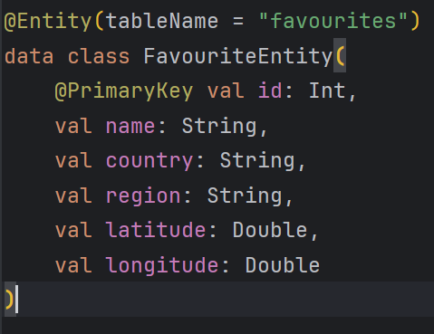
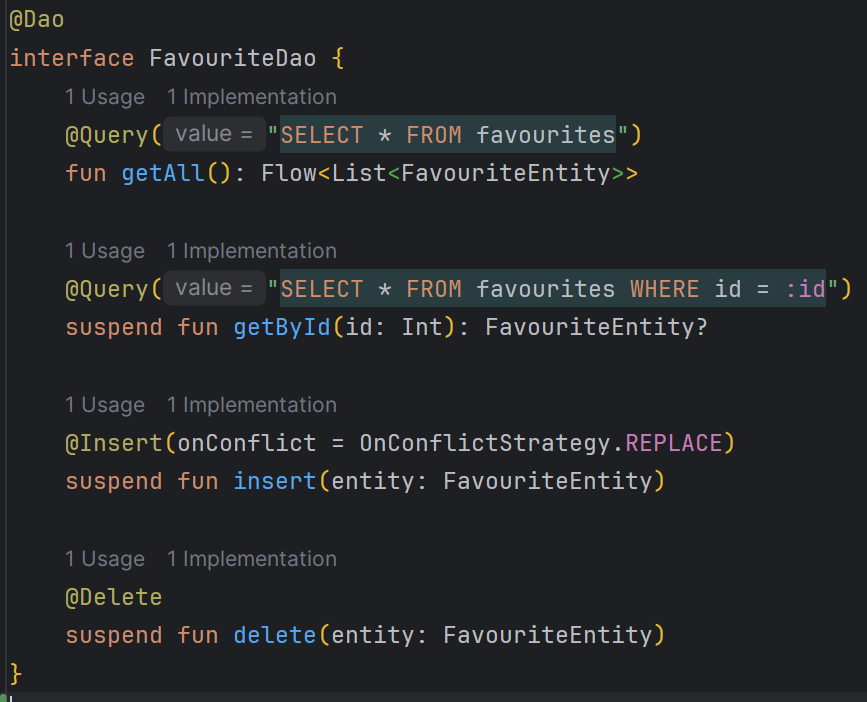
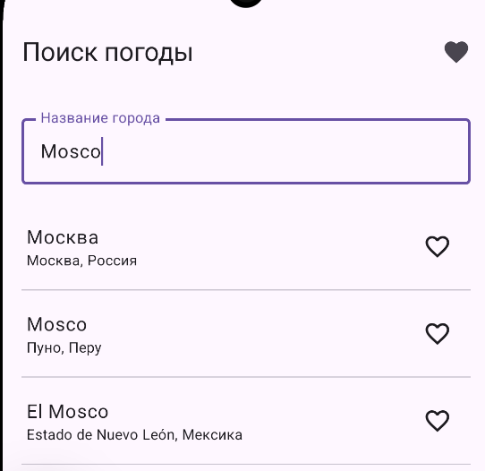
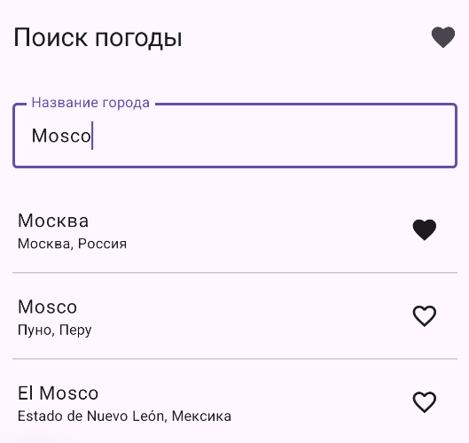
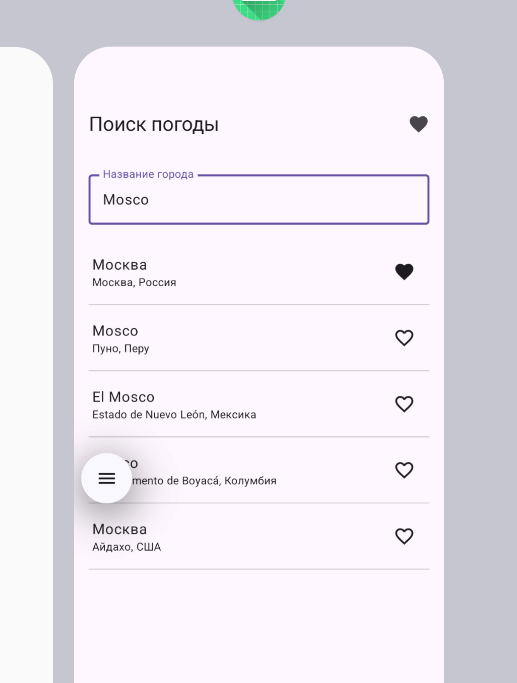
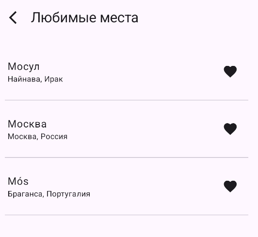
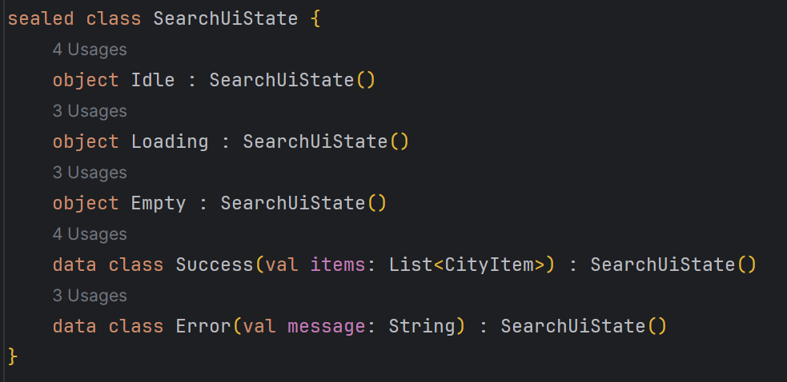
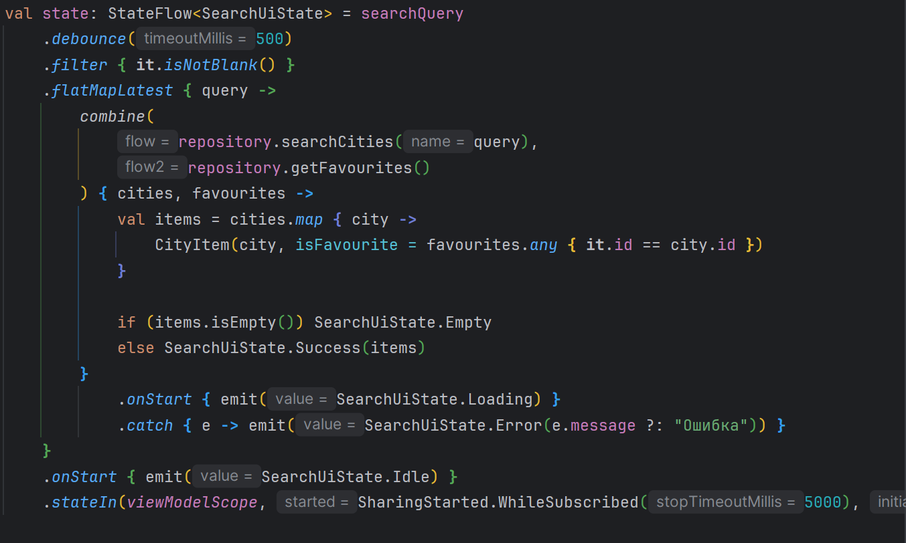
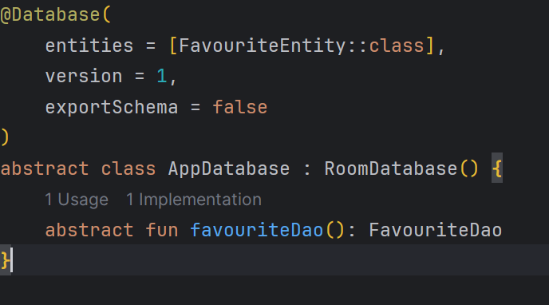
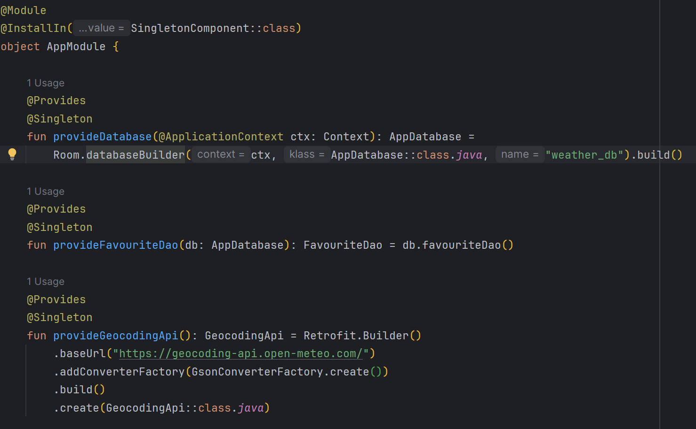

Стародубов Павел Павлович - Б9123.09.03.03(ЦТЭ)

API:
GET("v1/forecast?latitude={}&longitude={}&current_weather={}) - получение самой погоды города
GET("v1/search?name={}&count={}&language) - получение данных города

что храните в Room (таблица + сценарий)

как проверить (короткий сценарий “сделал - перезапустил - осталось”)
сценарий работает

4–6 скриншотов (Loading/Error/List/Detail + состояние Room)

