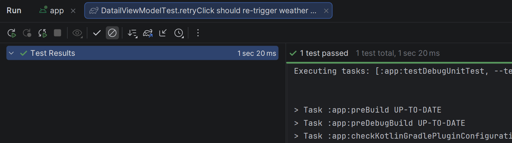
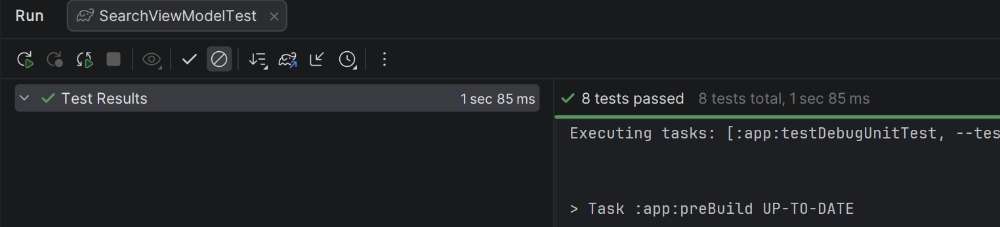
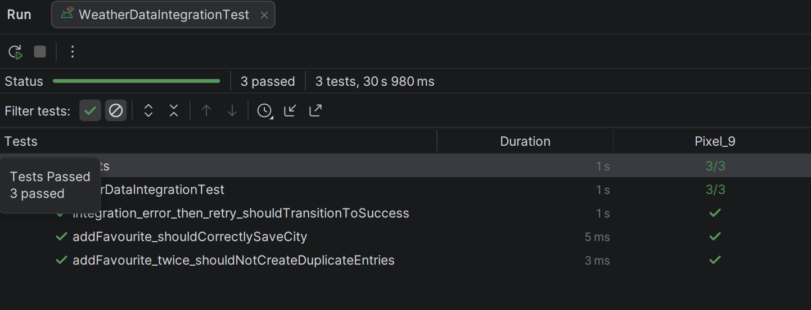

Стародубов Павел Павлович - Б9123.09.03.03(ЦТЭ)

Юнит-тесты
Расположение: app/src/test/
Тесты проводятся изолированно с использованием заглушек (Mocks). Покрывают логику класса SearchViewModel и маппинг моделей.

    initial state should be Idle
        Описание: Проверяет корректность начального состояния экрана при первом создании ViewModel. Экран должен сразу отображать SearchUiState.Idle.

    search success should emit Loading then Success
        Описание: Проверяет успешную загрузку данных. Тестирует полную цепочку переходов состояний: 

    empty search result should emit Empty state
        Описание: Проверяет бизнес-логику обработки пустых результатов. Если API вернул пустой список городов, состояние должно измениться на Empty, а не на Success(emptyList).

    repository error should emit Error state
        Описание: Проверяет безопасность приложения. Любые сетевые исключения перехватываются блоком catch во ViewModel и безопасно трансформируются в состояние Error без падения приложения.

    retryClick should re-trigger search after network error
        Описание: Проверяет работу механизма повтора запроса. После возникновения сетевой ошибки нажатие кнопки "Повторить" должно корректно инициировать новый сетевой запрос.

    rapid input should cancel previous search and only return last
        Описание: Проверяет работу поискового буфера. При быстром вводе (например, "A" → "AB") первый запрос должен отмениться на этапе debounce или flatMapLatest, предотвращая гонку данных и лишние запросы к серверу.

    items should correctly map isFavourite flag
        Описание: Проверяет логику реактивного слияния данных. При получении городов из сети их статус isFavourite должен корректно вычисляться на основе текущего списка избранного из БД.

    model mapping toCity should correctly convert fields
        Описание: Тест на слой данных (преобразование моделей). Гарантирует, что mapper-функция toCity() без ошибок переносит все поля из DTO в доменную модель, устанавливая дефолтный статус избранного в false.

Интеграционные тесты (Integration Tests)
Расположение: app/src/androidTest/
Запускаются в инструментальной среде (на эмуляторе или реальном устройстве) для тестирования реального взаимодействия компонентов приложения. База данных Room инициализируется в оперативной памяти (inMemoryDatabaseBuilder) [1.3], что исключает влияние тестов друг на друга и на реальные данные пользователя.

    addFavourite_shouldCorrectlySaveCity (Связка: Repository + Room)
        Описание: Проверяет сквозную запись данных. Город передается в репозиторий, записывается в Room, после чего успешно считывается из базы в неизменном виде.

    removeFavourite_shouldEmitUpdatedListViaFlow (Связка: Repository + Room + Flow)
        Описание: Проверяет интеграцию при удалении. После удаления города из избранного, реактивный Flow базы данных должен автоматически прислать обновленный пустой список без повторных запросов.

    integration_error_then_retry_shouldTransitionToSuccess (Связка: ViewModel + Repository + Room + API)
        Описание: Большой сквозной сценарий интеграции UI-слоя. Симулирует падение сети при поиске (переход в Error), последующее восстановление сети и нажатие пользователем кнопки «Повторить» (успешный переход в Success).

Нетривиальные тесты (Контракт поведения)
Данные тесты проверяют не просто конечные значения, а соответствие поведения системы строго заданным контрактам. Если в тестах проверяется только финальный state.value, требование считается невыполненным.

    Контракт отмены устаревших запросов: Тест rapid input should cancel... гарантирует, что медленный запрос, запущенный ранее, автоматически отменяется при вводе нового символа. Старые данные никогда не попадут в UI и не затрут новый результат.

    Контракт уникальности в БД (Conflict Strategy): Тест addFavourite_twice_shouldNotCreateDuplicateEntries проверяет, что при повторном добавлении города с тем же ID база данных не плодит дубликаты, а корректно перезаписывает существующую строку (тестирование OnConflictStrategy.REPLACE).

    Контракт восстановления после смерти процесса (SavedStateHandle): В тестах экрана деталей (DetailViewModelTest) аргументы навигации передаются не вручную, а через SavedStateHandle [1.2.8]. Это гарантирует, что cityId будет корректно восстановлен системой, даже если процесс приложения был убит из-за нехватки памяти [1.3].

Тесты на Coroutines & Flow
Тесты проверяют полную последовательность эмиссий, а не только конечное состояние.

    Тестирование последовательности (Turbine): В тестах успеха и ошибок проверяется вся цепочка вызовов шаг за шагом с помощью метода awaitItem(). Если корутина пропустит состояние Loading или перейдет в Error напрямую, тест упадет.

    Тестирование времени (Debounce): В тестах используется метод testScheduler.advanceTimeBy(600). Это позволяет точечно проверять поведение оператора debounce(500). Запросы, отправленные до истечения 500 мс, игнорируются, а после — успешно выполняются.

    Управление часами через runCurrent(): В тесте retryClick should re-trigger... для экрана деталей используется метод testScheduler.runCurrent(). Это предотвращает слияние (conflation) состояний Loading и Success при мгновенном ответе моков, позволяя зафиксировать переход в Loading до прокрутки виртуального времени вперед.

    Реактивный поток БД: Тест удаления из избранного проверяет, что база данных Room выступает в роли единственного источника правды (Single Source of Truth) и сама уведомляет подписчиков об изменениях через Flow, не требуя ручного обновления экрана.

