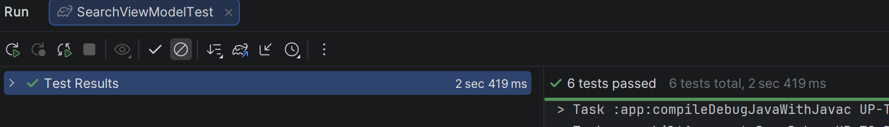
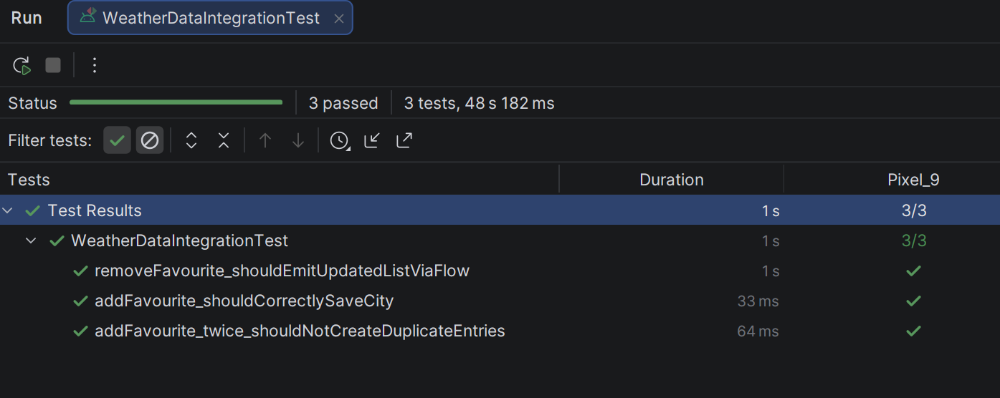
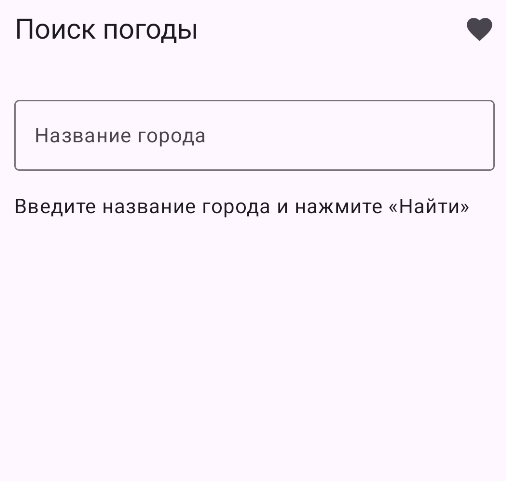

Стародубов Павел Павлович - Б9123.09.03.03(ЦТЭ)

Юнит-тесты

Проводятся с использованием MockK и Turbine. Покрывают логику SearchViewModel.

    initial state should be Idle: Проверка корректного начального состояния экрана.

    search success should emit Loading then Success: Проверка полной цепочки состояний при поиске.

    empty search result should emit Empty state: Проверка бизнес-логики: если API вернул 0 городов, стейт должен быть Empty, а не пустой Success.

    repository error should emit Error state: Проверка перехвата исключений и трансформации их в UI-состояние.

    items should correctly map isFavourite flag: Тест маппинга данных (проверка корректного объединения потока поиска и потока избранного).

Интеграционные тесты (app/src/androidTest/)

Запускаются на эмуляторе. Проверяют связку Repository + Room DAO. база данных в оперативной памяти.

    addFavourite_shouldCorrectlySaveCity: Проверка интеграции: данные проходят через репозиторий и корректно сохраняются/читаются из таблиц Room.

    removeFavourite_shouldEmitUpdatedListViaFlow: Проверка интеграции слоев при удалении данных.

Нетривиальные тесты 

Тесты по контракт поведения системы.

    rapid input should cancel previous search: Проверяет, что при быстром вводе (A -> AB) первый запрос отменяется и в UI не попадают данные от старого запроса. Тестирует работу оператора flatMapLatest.

    addFavourite_twice_shouldNotCreateDuplicateEntries: Проверяет контракт уникальности данных. При повторной попытке записи объекта с тем же ID, в базе остается ровно одна запись -> тестирование Conflict.Replace.

Тесты на Flow

тесты проверяют последовательности эмиссий, а не только value.

    Тестирование последовательности (Turbine): В тесте search success проверяется вся цепочка: Idle -> Loading -> Success. Если пропустить Loading, тест упадет.

    Тестирование времени : В тестах используется testScheduler.advanceTimeBy(600), что позволяет проверять корректность работы оператора debounce(500).

    Реактивный поток БД: Интеграционный тест удаления проверяет, что Flow автоматически генерирует новое событие (пустой список) сразу после вызова метода удаления, без повторного запроса.

